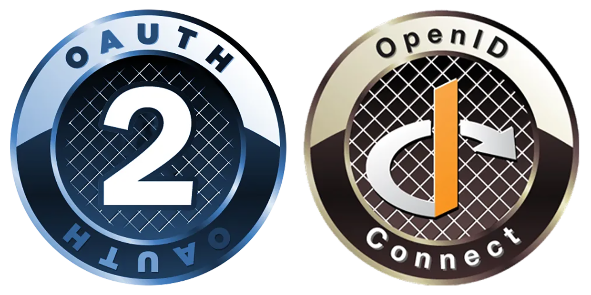
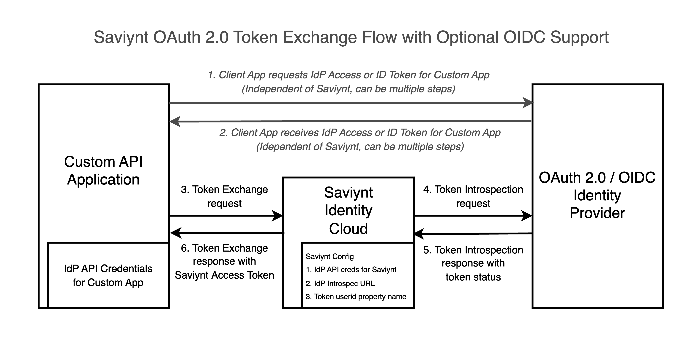

## Introduction

OAuth 2.0 and OpenID Connect are the most popular and important security protocols for modern API connectivity. While there are many ways to implement OAuth 2.0 and OIDC, a key use case for these protocols is to enable service account authorization for APIs and background tasks integrated with third-party Identity Providers (IdPs) for Single Sign-On (SSO). This allows using an IdP such as Microsoft Entra ID, Okta, or Ping Identity as your IdP for background, service account access to Saviynt Identity Cloud APIs. IdP and SSO support have been a popular request to our product team so we are happy to roll this out.

Specifically, this is implemented using industry standards OAuth 2.0 Token Exchange flow ([IETF RFC-8693](https://datatracker.ietf.org/doc/html/rfc8693)) and the associated OAuth 2.0 Token Introspection API ([IETF RFC-7662](https://datatracker.ietf.org/doc/html/rfc7662)). The token exchange can be performed submitting an IdP OAuth 2.0 access token or an IdP OIDC ID token to Saviynt Identity Cloud, which will exchange it for a Saviynt OAuth 2.0 access token. Read more below for an overview and in our [documentation for "Configuring OAuth 2.0 Token Exchange Authentication"](https://docs.saviyntcloud.com/bundle/EIC-Admin-v24x/page/Content/Chapter06-EIC-Configurations/OAuth-Token-Exchange.htm).

## How it Works

At a high level, OAuth 2.0 Token Exchange works with applications requesting a Saviynt Identity Cloud API Access Token by presenting and IdP issued token, which can be an OAuth 2.0 access token or an OIDC ID token, both issued by the IdP. There are 3 major parts to such an integration, described below.

The diagram below outlines the high-level flow steps. The credentials and URL configuration needs to be done first as descrbed below. Then there is a 3 part flow. The first part of the flow (Steps 1 and 2) with the custom app receiving an IdP access or OIDC ID token is done independently of Saviynt.



### Configuring Saviynt Identity Cloud for Token Introspection

To configure Svaiynt Identity Cloud, you will need to configure it to call your IdP's IETF RFC-7662 Token Exchange API. This way, when a token exchange request is made to Saviynt Identity Cloud, Saviynt can call your IdP to validate the access or ID token.

Addtionally, any IdP API credentials such as application client ID and client secret, will need to be configured in both your IdP and Saviynt. The following parameters need to be updated in your `externalconfig.properties` file.

```
MSOPENID.CLIENTID=<IdP App Client ID>
MSOPENID.CLIENTSECRET= <IdP App Secret>
MSOPENID.INTROSPECTION.URL=<IdP Introspection API>
MSOPENID.USERNAMEINJSON=preferred_username, sub
```

### Making the Token Exchange Request

The Token Exchange request occurs as Steps 3 and 6 in the diagram. It is designed and implemented by Saviynt is as follows. A sucessful reqwuest will return a Saviynt Identity Cloud OAuth 2.0 access token. Behind the scenes, Saviynt Identity cloud is making a Token Introspection API call to your IdP described in the next section.

```
POST https://<SAVIYNT_HOSTNAME>/ECM/oauth2/token
Content-Type: application/x-www-form-urlencoded
Accept: application/json

grant_type=urn:ietf:params:oauth:grant-type:token-exchange& \
subject_token_type_type=urn:ietf:params:oauth:token-type:access_token& \
subject_token={access token from the IdP}
```

### Making the Token Introspection Request

Inline to the Token Exchange Request from your client, Saviynt will make a Token Introspection API request to your IdP to ensure the token is still valid (Steps 4 and 5). It is important to note that this is a live call to your IdP.

```
POST /introspect HTTP/1.1
Host: <your_idp_host>
Accept: application/json
Content-Type: application/x-www-form-urlencoded
Authorization: Bearer <IdP access token for Saviynt Identity Cloud>

token=<IdP access or ID token being exchagned for a Saviynt Identity Cloud access token>
```

## Next Steps

We are very excited about this enhancement and look forward to our customers trying this out. If you have any questions on this, feel free to post on the [Saviynt Forums](https://forums.saviynt.com/). If you have any feature requests for different OAuth 2.0 flows or OpenID Connect capabilities, please post on the [Saviynt Ideas Portal](https://ideas.saviynt.com/).
