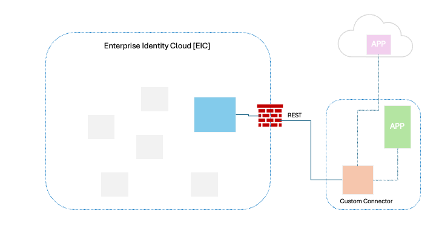

import DocCardList from '@theme/DocCardList';
import {useCurrentSidebarCategory} from '@docusaurus/theme-common';

# External Connector Framework

## Overview

The External Connector Framework (ECF) enables developers to seamlessly integrate with Saviynt Enterprise Identity Cloud (EIC). It provides unparalleled flexibility in terms of choosing the language for development along with complete control of the deployment environment.

Standards based API specification is provided, which ensures that the integration between a custom connector on ECF can be integrated with EIC with no additional requirement (version). The API itself is available in OpenAPI. 3rd party generators can be used to generate base code in one of the available languages.

<!-- img alt="External Connector Framework overview" src="../../../../static/img/ECF_Arch.png" / -->

## Key Capabilities
Following are the key framework capabilities

* Self-managed: The custom connector can be deployed in one's own infrstructure, thereby allowing complete control on the deployment cycle.

* Quick Time-To-Value: The deployement model allows for ease of deployment and debugging during the development cycle, thereby enabling a quicker time to value.

* Technology flexibility: The framework defines a language-agnostic API specification, enabling the development of custom connectors in any preferred programming language.

## API Documentation

API Documentation is available <b>[here](https://developers.saviynt.com/reference/ecf)</b>

## **Supported Use Cases:**
| Category | Object(s) | Use-case(s) | Supported? |
| -------- | --------- | ----------- | ---------- |
| Import | User | Full import | Yes |
| Import | Account | Full import | Yes |
| Import | Group (Entitlement) | Full import | Yes |
| Import | Role (Entitlement) | Full import | Yes |
| Provisioning | Account | Create account | Yes |
| Provisioning | Account | Update account | Yes |
| Provisioning | Account | Enable account | Yes |
| Provisioning | Account | Disable account | Yes |
| Provisioning | Account | Change Password | Yes |
| Provisioning | Account | Add Access | Yes |
| Provisioning | Account | Remove Access | Yes |
| Provisioning | User | Create user | No |
| Provisioning | User | Update user | Yes |
| Provisioning | User | Delete user | No |
