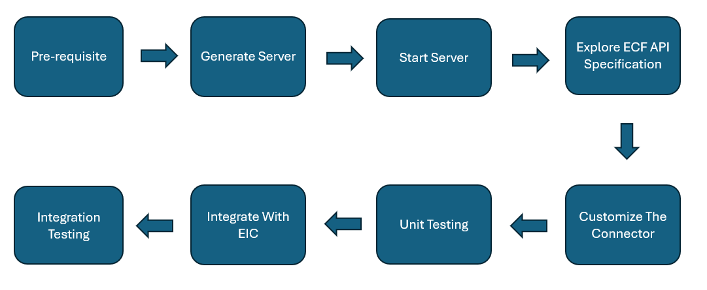

# Developer Guide

## Overview
This document outlines the steps for creating a connector using the External Connector Framework (ECF). Prior to jumping into the various details of connector creation, let's look into a high-level overview of the steps involved.

The above flow diagram lists out the various steps of the development lifecycle.

[Image](/static/Saviynt_logo_Nav.svg)

## Pre-Requisite:

1.	Identify the target application which needs to be integrated using ECF.
2.	Identify your preferred language for development and setup corresponding IDE.
3.	Ensure required libraries are installed for customizing the connector.

## Generate Server:

1.	Download https://github.com/saviynt/ExternalConnectorFramework-APISpec/blob/main/spec/OpenAPISpec.yaml file.
2.	Open Swagger Editor in web browser by navigating to https://editor.swagger.io/
3.	In the editor window, click on File --> Import file and select the OpenAPISpec.yaml from your system.
4.	You should be able to render the API specification on right panel.
5.	Now go to Generate Server -> select your preferred development language
6.	This will generate a zip file.

## Start Server:

1.	Unzip the downloaded server zip file.
2.	Start the server, This step may vary depending on language which was selected to generate the server in earlier step. 
3.	you should be able to get successful message around server is running and swagger-ui available with URL information.

Note: Server is by default started on 8080 port, in case there is already some other application running on this port, server startup may fail. You need to change server port to other than 8080 and then start same. Configuration file which contains port number should be available under unzipped folder.

## Explore ECF API Specification:

1.	Go to swagger UI URL. You should be able to access ECF API specification.
2.	You can explore the available APIs. This is useful as in further steps when you customize the connector you need to ensure that connector follows the endpoint definition, response format specified as per this specification.

## Customize the connector:

1. Open the generated project in your preferred IDE.
2. Customize the connector as per your requirement, implement logic for authentication, for each API operation handle request body processing, response generation etc.
3. Once complete customization is done.
4. Start the server.

## Unit Testing:

1.Go to swagger UI URL. You should be able to access the API specification as per your custom connector.
2. You can use "Try it out" feature of Swagger UI to perform quick unit testing of each implemented endpoints. 
3. Ensure the responses are in ECF specification format.

Note: You may choose to remove operations which you may not want to perform, however for operations which you want to perform it should follow the Saviynt provided ECF API specification.

## Integrate with EIC:

Once custom connector unit testing is successful, you should work with EIC administrator for this step. In this step, you will configure EIC artifacts needed to integrate the ECF based custom connector with EIC:

### Create connection:
1. Login to EIC.
2. Go to Admin -> Connections -> New Connection.
3. Select connection type as ECF.
4. Update connection details as per your server host URL and credentials.
5. There is no need to update any other json on connections page, these are preconfigured as per ECF specification.
6. Save connection.

### Create Security System and EndPoint:
1. Create a security system and use connection create in previous step as external connection and provisioning connection.
2. Create an endpoint for security system created in step 1.
3. Configure workflows as needed for provisioning operations.

## Integration Testing:

As part of this step, you will perform integration testing to ensure that the EIC & ECF based custom connector integration is successful.

### Import validation:
1. Configure import job for users/accounts/access: Configure and execute the import jobs for importing user/accounts/access from target application.
2. Validate that users/accounts/access and their relationship is successfully imported and correctly represented in EIC.

### Provisioning validation.
1. Use ARS/Rules to request various operations on accounts. 
2. Corresponding pening task should be created.
3. Configure and execute WSRetry provisioning job and validate if operation is performed as expected to target application.
4. Ensure EIC is correctly representing the state.

As part of integration testing perform testing of all required operations which are supported by your custom connector through EIC. Successfuly completion of same will conclude that connector development is succesfully completed.
