# Developer Guide

## Overview
This document outlines the steps for creating a connector using the External Connector Framework (ECF). Prior to jumping into the various details of connector creation, let's look into a high-level overview of the steps involved.

The above flow diagram lists out the various steps of the development lifecycle.

[Image](/static/Saviynt_logo_Nav.svg)
