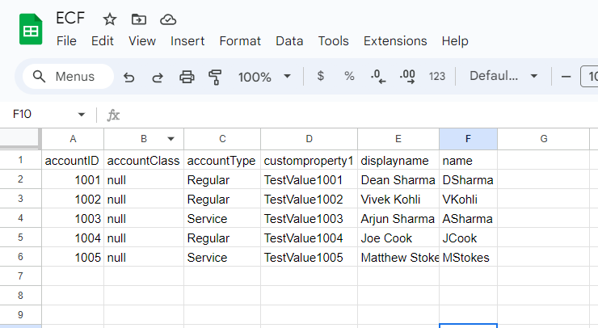
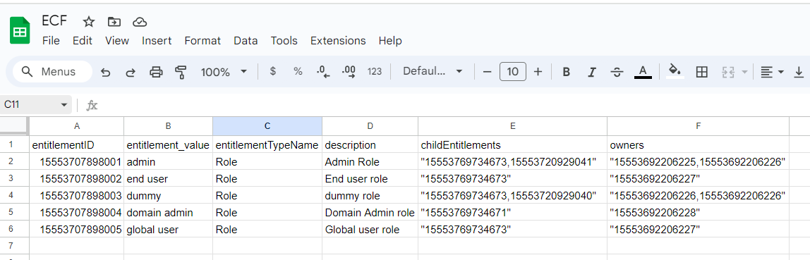
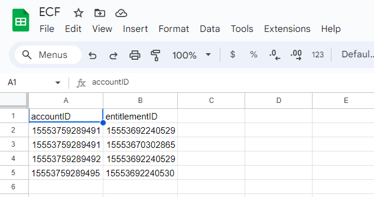

# Tutorial - Custom connector development in Node-JS 

This tutorial guides you through creating a Node.js-based web server that adheres to the ECF specification. By following these steps, you'll establish a connection between EIC and your target application, enabling data exchange and task execution.

## Pre-requisite(s)

1. <b><u>Node.js:</u></b> Download and install Node.js from the official website: <b>[nodejs.org](https://nodejs.org/en/download)</b>
2. <b><u>Open API Specification:</u></b> Download the ECF Open API specification file from GitHub: <b>[Open API Spec](https://github.com/saviynt/ExternalConnectorFramework-APISpec/blob/main/spec/OpenAPISpec.yaml)</b>.
3. <b><u>IDE:</u></b> Choose your preferred IDE (Integrated Development Environment) for Node.js development, such as <b>[Visual Studio](https://visualstudio.microsoft.com/downloads/)</b>.

## Steps to generate node-js server bundle

1. <b><u>Open Swagger Editor:</u></b> Launch the Swagger Editor in your web browser by visiting: <b>[swagger.io](https://editor.swagger.io/)</b>
2. <b><u>Import Open API Spec:</u></b> In the editor window, click File > Import File and select the downloaded OpenAPISpec.yaml file.
3. <b><u>Render API Specification:</u></b> The API specification should be displayed on the right panel.
4. <b><u>Generate Server Code:</u></b> Go to Generate Server > nodejs-server.
5. <b><u>Download Server Bundle:</u></b> This action will generate a ZIP file containing the Node.js server code.

## Steps to start node-js server

1. <b><u>Unzip Server Bundle:</u></b> Extract the downloaded ZIP file to create your Node.js project directory.
2. <b><u>Navigate to Project Directory:</u></b> Open your terminal or command prompt and navigate to the unzipped project directory.
3. <b><u>Run Server:</u></b> Execute the command npm start to start the server.
4. <b><u>Server Confirmation:</u></b> Upon successful execution, you should see a message similar to:
```
Your server is listening on port 8080 (http://localhost:8080)
Swagger-ui is available on <b>[/docs](http://localhost:8080/docs)</b>
```
This indicates that your Node.js server is running and accessible.

## Steps to explore the API Specification

1. <b><u>Open Web Browser:</u></b> Launch your web browser and navigate to <b>[/docs](http://localhost:8080/docs)</b>.
2. <b><u>API Spec Listing:</u></b> This page will display a list of all API specifications supported by the ECF.
3. <b><u>Explore Individual APIs:</u></b> Click on a specific API to explore its details, including request types, request parameters, body structure, and response formats. Utilize the "Try it out" option to test the API with sample data (note: you may need to provide a valid authorization token for some APIs).

## Deploying the Server

This section guides you through launching your Node.js server locally and customizing its configuration. It also briefly touches upon considerations for production deployment.

### Starting the Server Locally
1. <b><u>Open Terminal:</u></b> Launch your terminal or command prompt application.
2. <b><u>Navigate to Project Directory:</u></b> Use the cd command to change directories and navigate to the root directory of your unzipped project.
3. <b><u>Run Server:</u></b> Execute the command npm start to initiate the server.
4. <b><u>Server Confirmation:</u></b> Upon successful execution, you'll see a message similar to:
```
Your server is listening on port 8080 (http://localhost:8080)
Swagger-ui is available on [/docs](http://localhost:8080/docs)
```
This indicates that your Node.js server is running locally on port 8080 and accessible at <b>[/docs](http://localhost:8080/docs)</b>. You can open this URL in your web browser to explore the available APIs using Swagger UI.

### Customizing Server Configuration (Optional):
By default, the server runs on port 8080 using the HTTP protocol. Here's how to modify these settings:
1. <b><u>Locate package.json:</u></b> Open the package.json file within your project directory using a text editor.
2. <b><u>Edit Configuration:</u></b> Search for the scripts section within the file. You'll find properties like "start" that define commands used to start the server. Look for properties controlling port and protocol configurations (these might vary depending on the generated server code).
3. <b><u>Update Values:</u></b> Modify the values for port and protocol as needed. Common properties might include ```"start": "node index.js -p <port number>"```, where ```<port number>``` is the desired port. Refer to the specific documentation for your generated code if the properties have different names.
4. <b><u>Save Changes:</u></b> Save your modifications to the package.json file.
5. <b><u>Restart Server:</u></b> After making changes, stop the server using Ctrl+C in your terminal and then restart it using npm start again. The server will now run with your updated configuration.

### Using HTTPS (Optional)
In production environments, it's crucial to secure communication between your server and clients. The HTTPS protocol encrypts data transmission, protecting sensitive information and ensuring data integrity. This section provides a high-level overview of enabling HTTPS with a self-signed certificate (for development purposes only).

<b><u>Important Note:</u></b> Using a self-signed certificate is not recommended for production due to security concerns. Browsers will display warnings to users when they encounter self-signed certificates. For production environments, you should obtain a valid certificate issued by a trusted Certificate Authority (CA).

#### Enabling HTTPS with Self-Signed Certificate (Development Only):
1. <b><u>Generate a Self-Signed Certificate:</u></b>
	* Install OpenSSL if it's not already available on your system. You can find installation instructions online for your specific operating system.
	* Run the following command in your terminal to generate a self-signed certificate and key:
	```
	openssl req -nodes -new -x509 -keyout server.key -out server.cert
	```
	* Follow the prompts to provide information like your organization name and location. This information is embedded within the certificate.
2. <b><u>Place the Certificate and Key Files:</u></b>
	* Move the generated ```server.key``` and ```server.cert``` files to your project's base directory.
3. <b><u>Configure ```index.js``` for HTTPS:</u></b>
	* Locate the index.js file in your project.
	* Update the code to use the generated certificate and key for HTTPS. Here's an example:

<details>
<summary> Using SSL </summary>
<p>
```javascript
const fs = require("fs");
var https = require('https');
var serverPort = 443; // you can specify the port number
// add certificate details in options:
var options = {
    routing: {
        controllers: path.join(__dirname, './controllers')
    },
	key: fs.readFileSync("server.key"),
        cert: fs.readFileSync("server.cert"),
};
// pass the options while creating server
https.createServer(options, app).listen(serverPort, function () {
    console.log('Your server is listening on port %d (https://localhost:%d)', serverPort, serverPort);
    console.log('Swagger-ui is available on https://localhost:%d/docs', serverPort);
});
```
</p>
</details>

4. <b><u>Start the Server:</u></b>
	* Run npm start in your terminal to launch the server with HTTPS enabled.
5. <b><u>Access the Server:</u></b>
	* You can now access your server securely using HTTPS. Open ```https://localhost:<port number>/docs``` (replace \<port number\> with the port you specified) in your web browser. However, due to the self-signed certificate, your browser will likely display a warning message. This is expected for development purposes.

	<b><u>Remember:</u></b> This approach is for development and testing only. In production, you should obtain a valid certificate from a trusted CA to ensure secure communication and avoid browser warnings.

## Customizing the Connector for Target Application Integration
Once you've generated the Node.js server project and imported it into your preferred IDE (like Visual Studio), you can customize it to integrate with your specific target application. This customization process involves establishing a connection, data exchange, and endpoint exposure as outlined in the ECF specification.

<b><u>Key Objectives:</u></b>
	* <b><u>Target Application Connection:</u></b> Develop logic to establish a secure connection with your target application using appropriate authentication methods and protocols.
	* <b><u>Data Fetching and Provisioning:</u></b> Implement functionality to retrieve data from the target application based on ECF API requests. Conversely, you might need to implement functionalities to provision data to the target application as dictated by ECF API calls.
	* <b><u>REST Endpoint update:</u></b> Update the REST endpoints that adhere to the ECF specification. These endpoints will be invoked by EIC to interact with your custom connector and facilitate data exchange.
<b><u>Example Considerations for Node.js Development:</u></b>
	* <b><u>Utilize Third-Party Libraries:</u></b> Depending on your target application's API and communication protocols, you might leverage Node.js libraries like axios for making HTTP requests or libraries like socket.io for real-time communication.
	* <b><u>Data Transformation and Validation:</u></b> Implement logic to handle potential data format differences between your connector and the target application. You might need to transform or validate data before sending it to or receiving it from the target application.
	* <b><u>Error Handling and Logging:</u></b> Design a robust error handling mechanism to capture and log any issues encountered during communication with the target application or data processing. This will aid in troubleshooting and debugging.
<b><u>Additional Notes:</u></b>
	Refer to the ECF specification documentation for detailed information about supported API calls, request structures, response formats, and authentication mechanisms.
Secure your connector implementation by following best practices for handling sensitive data and credentials.

<b><u>Remember:</u></b> This section provides a high-level overview of the customization process. The specific implementation details will vary depending on your target application and the functionality required by the ECF integration.

### Implementing Bearer Token Authentication (Optional)
The default server implementation includes bearer token authentication for all API calls. Any request without an authorization header will result in a failed request. However, since this is a sample specification, there's no defined token value. You can provide any random value for authorization during development.

<b><u>Important Note:</u></b> In a real-world scenario, static token values pose a security risk. You should implement a proper authorization mechanism to secure your server.

<b><u>Example:</u></b> Modifying controllers/AccountImport.js

This example demonstrates how a developer might implement a basic (and insecure) authentication check by modifying the controllers/AccountImport.js file:

<details>
<summary> Setting up Authentication </summary>
<p>
``` javascript
module.exports.apiV1AccountsPOST = function apiV1AccountsPOST (req, res, next, body, offSet, pageSize) {

// sample custom code here to perform authorization
const authHeader = req.headers['authorization'] &&
            req.headers['authorization'].toLowerCase();

if (!(authHeader.toLowerCase() === "bearer <token value>")) {
            throw Error(`Authorization token not correct`);
		}
// sample code completed

Default.apiV1AccountsPOST(body)
    .then(function (response) {
      utils.writeJson(res, response);
    })
    .catch(function (response) {
      utils.writeJson(res, response);
    });
};
```
</p>
</details>

<b><u>Explanation:</u></b>
	1. The code retrieves the Authorization header from the incoming request.
	2. It checks if the header exists and is in lowercase format "bearer \<token value\>".
	3. It compares the extracted token value with a pre-defined static value (your_actual_token_value).
	4. If there's a mismatch, an error is thrown.
	5. If the token matches (insecure in production), the code proceeds with default functionality.

<b><u>Remember:</u></b> This is a simplified example for demonstration purposes only. In a production environment, you should implement a robust authorization mechanism. This might involve:
	* Issuing tokens to authorized users or applications.
	* Validating tokens against a centralized authentication server.
	* Implementing token expiration and refresh mechanisms.

	For production-grade security, explore established authentication frameworks and libraries for Node.js, such as Passport.js or JSON Web Tokens (JWT).

### Bearer Token Encoding and Decoding (Optional)
While the previous section discussed basic authentication using a static token value, real-world scenarios require more secure approaches. Bearer tokens are commonly used for authorization in REST APIs. These tokens are typically issued by an authorization server and contain encoded information about the user or application making the request.

<b><u>Understanding Bearer Tokens:</u></b>
	* Bearer tokens are typically sent in the Authorization header of an HTTP request with the format Bearer ```<token value>```.
	* The token value itself might be a Base64-encoded string containing user information, claims, and an expiration timestamp.
	* The server receiving the request decodes the token and validates its claims against an authorization server or a local token store.

<b><u>Important Note:</u></b> Base64 encoding does not provide encryption. It simply encodes binary data into a human-readable format. To ensure token security, you should:
	* Use a library like jsonwebtoken (JWT) to create and validate tokens signed with a secret key. JWT tokens are self-contained and include expiration times, making them a secure choice for authorization.
	* Store secret keys securely (e.g., environment variables) and never expose them in your code.
	* Implement token refresh mechanisms to handle token expiration.

<b><u>Example: Base64 Encoding/Decoding (for illustration only):</u></b>
This example demonstrates basic Base64 encoding and decoding, which can be a preliminary step for working with tokens. However, it's crucial to understand that this approach is not secure for production use.

<details>
<summary> Encoding/decoding bearer token </summary>
<p>
```javascript
const stringToEncode = 'Hello@12345$';
// Encoding the string to Base64 using ASCII encoding
const encodedString = Buffer.from(stringToEncode).toString('base64');
console.log('Base64 Encoded (UTF-8):', encodedString);
const decodedString = Buffer.from(encodedString, 'base64').toString('utf-8');
console.log('Base64 Decoded:', decodedString);
```
</p>
</details>

<b><u>Remember:</u></b> This section provides a high-level overview. For secure token management, explore established libraries like jsonwebtoken and follow best practices for token generation, validation, and storage. Refer to the documentation of these libraries for detailed usage instructions.

### Add logger:

Developer can refer below sample way of adding logger in custom connector.

1. Create a logger.js file under utils folder. In this file developer can define log level, log file location etc.

<details>
<summary> Adding logger </summary>
<p>
```javascript
// logger.js
const winston = require('winston');
// Configure Winston logger
const logger = winston.createLogger({
  level: 'info', // Set the minimum log level (e.g., 'info', 'warn', 'error')
  format: winston.format.simple(), // Use a simple log format
  transports: [
    new winston.transports.Console(), // Log to console
    new winston.transports.File({ filename: 'application.log' }) // Log to file
  ]
});
module.exports = logger;
```
</p>
</details>

2. Logging in /controllers/AccountProvisioning.js file

<details>
<summary> Logging </summary>
<p>
```javascript
module.exports.apiV1CreateAccountPOST = function apiV1CreateAccountPOST (req, res, next, body) {
    //Sample logger statement
    const logger = require('../utils/logger');
    logger.info("This is info message, calling create accounts API");
    //sample code complete
    Default.apiV1CreateAccountPOST(body)
      .then(function (response) {
        utils.writeJson(res, response);
      })
      .catch(function (response) {
        utils.writeJson(res, response);
    });
};
```  
</p>
</details>

Note: When you start the server with this configuration, this will create a application.log file at base project folder.

### Adding business logic

As a developer you can add business logic and validations as per requirement, below is just a sample, for e.g. if a developer wants to throw an error if firstName parameter value is missing in request body during account provisioning request.

Under Services/AccountProvisioningService.js → under Create Account API implementation, add below sample logic:

<details>
<summary> Implementing business logic </summary>
<p>
```javascript
exports.apiV1CreateAccountPOST = function(body) {
  return new Promise(function(resolve, reject) {
	  //sample code
   if (!body.hasOwnProperty('firstname')) {
      const errorResponse = {
        errorCode: "400",
        message: "Bad Request: Missing 'firstname' parameter in request body"
      };
      reject(errorResponse);
    }
    ...// rest code continues here
```
</p>
</details>

Note: Above is just an example of validation, developer has to ensure appropriate custom implementation logic is added in code. For e.g. if customer use case is to provision account to a target application, this custom connector code should be able to connect with target application, read the request body data, provision the account in actual target and return 200 status code.

Please refer appendix section, that contains few node-js based sample code which shows how custom implementation can be done to integrate Google Sheets (consider google sheet is a target application) and you need to write a ECF based custom connector which will act as intermediary for EIC and Google Sheets.
Developer should also consider implementing pageSize and offSet while writing logic for import operations for better performance. Sample code in Appendix section has references around how to use offset and pagesize to support pagination as well. 

## Sample code to integrate Google Sheets as target application

This section contains sample node-js code, which connects with Google Sheets, and performs import/provision operations. In this case it is considered that actual target application is google sheet, and developer wants to write a ECF based custom connector to integrate Google sheet with EIC.

### Accounts Import

Consider below is accounts data stored in sheet.



Below is sample code to read and return this data in ECF response format.

<details>
<summary> Transforming Response </summary>
<p>
```javascript
const { google } = require('googleapis');
const fs = require('fs');
const readline = require('readline');

// Load credentials from JSON file
const credentials = require('./utils/external-connector-framework-09842e2d8788.json');

// Create a new JWT client using the credentials
const auth = new google.auth.JWT(
  credentials.client_email,
  null,
  credentials.private_key,
  ['https://www.googleapis.com/auth/spreadsheets']
);

// Create a new instance of Google Sheets API
const sheets = google.sheets({ version: 'v4', auth });

// ID of the Google Sheet
const spreadsheetId = '1tZyExhNelfLaI68oBI3DwWly2p1xfY7VJ1k_CaOzoP0';

// Function to read data from the Google Sheet with offset and pageSize
async function readData(offset, pageSize) {
  try {
    const headerRange = 'Accounts!1:1'; // Range for header row
    const headerResponse = await sheets.spreadsheets.values.get({
      spreadsheetId,
      range: headerRange,
    });
    const headers = headerResponse.data.values[0];
    
// Calculate range based on offset and pageSize
const dataStartRow = offset + 2; // Offset starts from data row 1 (after header)
const range = `Accounts!A${dataStartRow}:F${dataStartRow + pageSize - 1}`;

const response = await sheets.spreadsheets.values.get({
  spreadsheetId,
  range,
});

const rows = response.data.values;
if (rows.length) {
  const totalCount = rows.length;
  const accounts = rows.map(row =\> {
    const account = {};
    headers.forEach((header, index) =\> {
      account[header] = row[index] || ''; // Ensure each header has a corresponding value
    });
    return account;
  });
  console.log(JSON.stringify({
    offset: offset,
    totalCount: totalCount,
    accounts: accounts
  }, null, 2));

} else {
  console.log(JSON.stringify({
    offset: offset,
    totalCount: 0,
    accounts: []
  }, null, 2));
}
} catch (err) {
    console.error('The API returned an error:', err);
  }
}

// Call the function with offset and pageSize
readData(0, 2);
```
</p>
</details>

### Role Entitlement Import:

Consider below is role entitlement data stored in sheet.



below is sample code to read and return this data in ECF format:

<details>
<summary> Entitlement import - Role data </summary>
<p>
```javascript
const { google } = require('googleapis');
const fs = require('fs');
const readline = require('readline');

// Load credentials from JSON file
const credentials = require('./utils/external-connector-framework-09842e2d8788.json');

// Create a new JWT client using the credentials
const auth = new google.auth.JWT(
  credentials.client_email,
  null,
  credentials.private_key,
  ['https://www.googleapis.com/auth/spreadsheets']
);

// Create a new instance of Google Sheets API
const sheets = google.sheets({ version: 'v4', auth });

// ID of the Google Sheet
const spreadsheetId = '1tZyExhNelfLaI68oBI3DwWly2p1xfY7VJ1k_CaOzoP0';

// Function to read data from the Google Sheet with offset and pageSize
async function readData(offset, pageSize) {
  try {
    const headerRange = 'Entitlements_Roles!1:1'; // Range for header row
    const headerResponse = await sheets.spreadsheets.values.get({
      spreadsheetId,
      range: headerRange,
    });
    const headers = headerResponse.data.values[0];
// Calculate range based on offset and pageSize
const dataStartRow = offset + 2; // Offset starts from data row 1 (after header)
const range = `Entitlements_Roles!A${dataStartRow}:F${dataStartRow + pageSize - 1}`;

const response = await sheets.spreadsheets.values.get({
  spreadsheetId,
  range,
});

const rows = response.data.values;

if (rows.length) {
  const totalCount = rows.length;
  const roles = rows.map(row =\> {
    const role = {};
    headers.forEach((header, index) =\> {
      if (header === 'childEntitlements') {
        // Parse multi-valued data into an array of objects
        const childEntitlements = row[index].split(',').map(value =\> {
          return { entitlementID: value.trim() };
        });
        role[header] = { roles: childEntitlements };
      } else if (header === 'owners') {
        // Parse multi-valued data into an array of strings
        role[header] = row[index].split(',').map(value =\> value.trim());
      } else {
        role[header] = row[index];
      }
	});
    return role;
  });
  console.log(JSON.stringify({
    offset: offset,
    totalCount: totalCount,
    roles: roles
  }, null, 2));

} else {
  console.log(JSON.stringify({
    offset: offset,
    totalCount: 0,
    roles: []
  }, null, 2));
}
} catch (err) {
    console.error('The API returned an error:', err);
  }
}

// Call the function with offset and pageSize
readData(0, 2);
```
</p>
</details>

### Role-Accounts membership import:

Consider below is role-account membership data stored in sheet.



below is sample code to read and return this data in ECF format:

<details>
<summary> Entitlement import - Role to Accounts </summary>
<p>
```javascript
const { google } = require('googleapis');
const fs = require('fs');
const readline = require('readline');
// Load credentials from JSON file
const credentials = require('./utils/external-connector-framework-09842e2d8788.json');
// Create a new JWT client using the credentials
const auth = new google.auth.JWT(
  credentials.client_email,
  null,
  credentials.private_key,
  ['https://www.googleapis.com/auth/spreadsheets']
);
// Create a new instance of Google Sheets API
const sheets = google.sheets({ version: 'v4', auth });
// ID of the Google Sheet
const spreadsheetId = '1tZyExhNelfLaI68oBI3DwWly2p1xfY7VJ1k_CaOzoP0';
// Function to read data from the Google Sheet with offset and pageSize
async function readData() {
  try {
    const headerRange = 'Roles_Memberships!1:1'; // Range for header row
    const headerResponse = await sheets.spreadsheets.values.get({
      spreadsheetId,
      range: headerRange,
    });
    const headers = headerResponse.data.values[0];
// Calculate range based on offset and pageSize
const dataStartRow = 2; // Offset starts from data row 1 (after header)
const range = `Roles_Memberships!A${dataStartRow}:F`;
const response = await sheets.spreadsheets.values.get({
  spreadsheetId,
  range,
});
const rows = response.data.values;
if (rows.length) {
  const count = rows.length;
  const role_memberships = rows.map(row =\> {
    const membership = {};
    headers.forEach((header, index) =\> {
      membership[header] = Number(row[index]);
    });
    return membership;
  });
  console.log(JSON.stringify({
    count: count,
    role_memberships: role_memberships
  }, null, 2));
} else {
  console.log(JSON.stringify({
    count: 0,
    role_memberships: []
  }, null, 2));
}
} catch (err) {
    console.error('The API returned an error:', err);
  }
}
// Call the function with offset and pageSize
readData(0, 2);
```
</p>
</details>

### Account Provisioning:

Below is sample code which can be used to provision an account. This uses sample hardcoded account data, ideally this will be received by your custom connector from EIC when create account task is provisioned, you should read this account data from request body and process it further.

<details>
<summary> Account provisioning </summary>
<p>
```javascript
const { google } = require('googleapis');
const fs = require('fs');
// Load credentials from JSON file
const credentials = require('./utils/external-connector-framework-09842e2d8788.json');
// Create a new JWT client using the credentials
const auth = new google.auth.JWT(
  credentials.client_email,
  null,
  credentials.private_key,
  ['https://www.googleapis.com/auth/spreadsheets']
);
// Create a new instance of Google Sheets API
const sheets = google.sheets({ version: 'v4', auth });
// ID of the Google Sheet
const spreadsheetId = '1tZyExhNelfLaI68oBI3DwWly2p1xfY7VJ1k_CaOzoP0';
// Function to write data to the Google Sheet
async function writeDataToSheet(data) {
  try {
    const values = [Object.values(data)];
  const response = await sheets.spreadsheets.values.append({
  spreadsheetId: spreadsheetId,
  range: 'Accounts!A:A', // Assuming data will be written to Sheet1
  valueInputOption: 'RAW',
  requestBody: {
    values: values
  }
});
console.log(`${response.data.updates.updatedCells} cells appended.`);
} catch (err) {
    console.error('The API returned an error:', err);
    throw err;
  }
}
// Example data to write to the Google Sheet
const data = {
  "accountID": "1006",
  "accountClass": "NA",
  "accountType": "NoType",
  "customproperty1": "McNeil",
  "displayname": "N",
  "name": "MNeil"
};
// Call the function to write data to the Google Sheet
writeDataToSheet(data);
```
</p>
</details>

### Provision Account-Role membership (Access provisioning):

Below is sample code which can be used to provision a role access to an account. This uses sample hardcoded input data, ideally this will be received by your custom connector from EIC when add access task for role is provisioned, you should read this data from request body and process it further.

<details>
<summary> Access provisioning </summary>
<p>
```javascript
const { google } = require('googleapis');
const fs = require('fs');
// Load credentials from JSON file
const credentials = require('./utils/external-connector-framework-09842e2d8788.json');
// Create a new JWT client using the credentials
const auth = new google.auth.JWT(
  credentials.client_email,
  null,
  credentials.private_key,
  ['https://www.googleapis.com/auth/spreadsheets']
);
// Create a new instance of Google Sheets API
const sheets = google.sheets({ version: 'v4', auth });
// ID of the Google Sheet
const spreadsheetId = '1tZyExhNelfLaI68oBI3DwWly2p1xfY7VJ1k_CaOzoP0';
// Function to write data to the Google Sheet
async function writeDataToSheet(data) {
  try {
    const values = [Object.values(data)];
    const response = await sheets.spreadsheets.values.append({
  spreadsheetId: spreadsheetId,
  range: 'Roles_Memberships!A:A', // Assuming data will be written to Sheet1
  valueInputOption: 'RAW',
  requestBody: {
    values: values
  }
});
console.log(`${response.data.updates.updatedCells} cells appended.`);
  } catch (err) {
    console.error('The API returned an error:', err);
    throw err;
  }
}
// Example data to write to the Google Sheet
const data = {
  "accountID": "15553759289495",
  "entitlementID": "15553692240530"
};
// Call the function to write data to the Google Sheet
writeDataToSheet(data);
```
</p>
</details>

